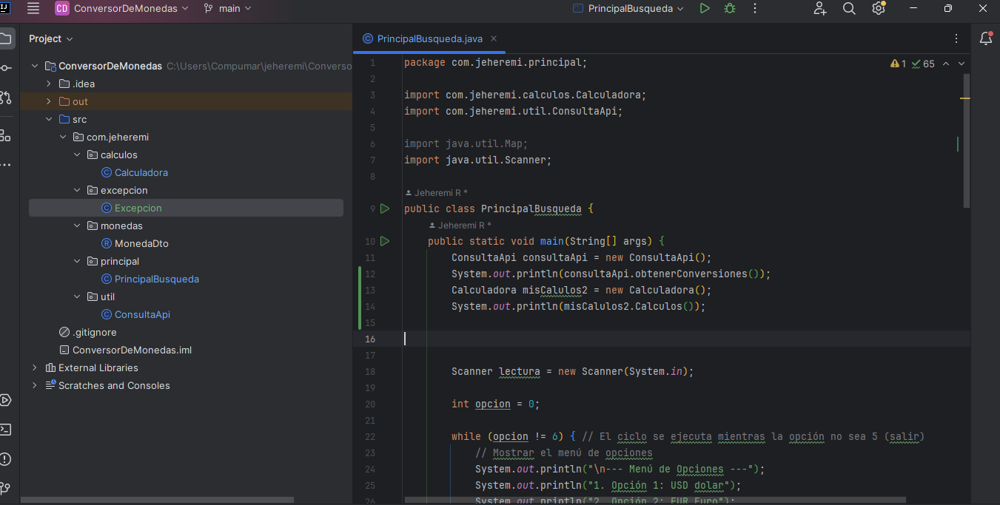

APP CONVERSOR DE MONEDAS.

Este proyecto es una aplicación backend que permite consultar la API de ExchangeRate para obtener el valor actual de una moneda y realizar operaciones de conversión a otras divisas. La aplicación es parte de la formación Java/Backend en Alura Latam.

Descripción
La aplicación interactúa con la API de ExchangeRate para obtener los valores de conversión actualizados entre distintas monedas. Además de consultar el valor actual de una divisa específica, permite al usuario realizar conversiones de manera sencilla entre diferentes monedas.

Funcionalidades:

Consulta del valor actual de una moneda a través de la API de ExchangeRate.
Conversión de montos entre diversas monedas.
Manejo eficiente de tasas de cambio con respuestas rápidas y precisas.

Se ha utilizado la librería Gson para procesar las respuestas en formato JSON de la API y Map de Java para manejar los datos de las tasas de conversión de forma eficiente.

Tecnologías utilizadas:

Java 17 - Lenguaje principal utilizado en la aplicación.

Spring Boot - Framework para la creación del backend.
Maven - Para la gestión de dependencias.

API ExchangeRate - Fuente de las tasas de conversión de monedas.

Instalación y ejecución: Prerrequisitos:

Tener Java 17 o superior instalado.

Tener Maven instalado.

Este proyecto fue desarrollado como parte del curso de Java Backend de Alura Latam.

### Estructura del Proyecto: fase inicial

### Estructura final del proyecto y funcionamiento
##### https://youtu.be/Ziqm7yitaT8

Desarrollado por Jeheremi Ruiz
